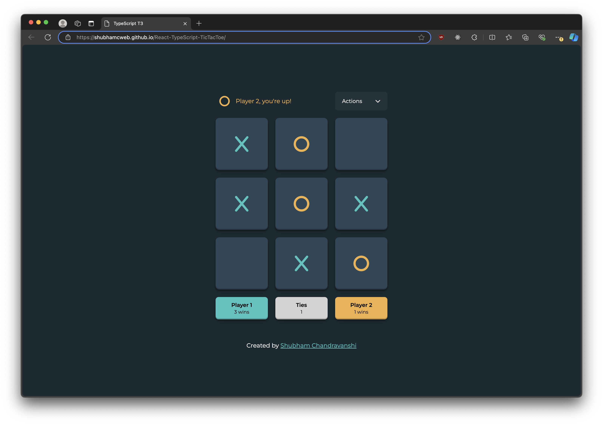

# React-TypeScript-TicTacToe

This branch is the React implementation of the Tic-Tac-Toe project. The game is deployed via GitHub Pages and can be accessed here at: [Live Site](https://shubhamcweb.github.io/React-TypeScript-TicTacToe/)

You can also check out the TypeScript & vanilla JavaScript implementation on the typescript-build and vanilla-build branches respectively.

## Features

- Interactive Tic-Tac-Toe game built with React and TypeScript.
- Persistent game state using `localStorage`.
- Responsive design for various screen sizes.
- Clear visual indicators for player turns and game status.

## Learnings

During this project, I learned and applied several key concepts and technologies:

- **TypeScript**: Leveraged TypeScript to add static typing to the project, ensuring better code quality and maintainability.
- **React**: Developed a deeper understanding of React, including component-based architecture, state management, and hooks.
  - **useState**: Managed state within functional components.
  - **useEffect**: Handled side effects such as updating `localStorage` and syncing game state across tabs.
- **Non-Mutating Code**: Ensured state immutability for reliable state updates and predictable rendering.
- **Project Setup**: Used `bun` to initialize the project, which streamlined the setup process and optimized performance.

## Author

Hi, I'm Shubham Chandravanshi. If you have any questions or feedback related to this project, or if you just want to connect, feel free to reach out to me at:

- **Email**: [shubhamcweb@gmail.com](mailto:shubhamcweb@gmail.com)
- **LinkedIn**: [linkedin.com/in/shubhamcweb](https://linkedin.com/in/shubhamcweb)

I'm always open to discussing new ideas and opportunities!
